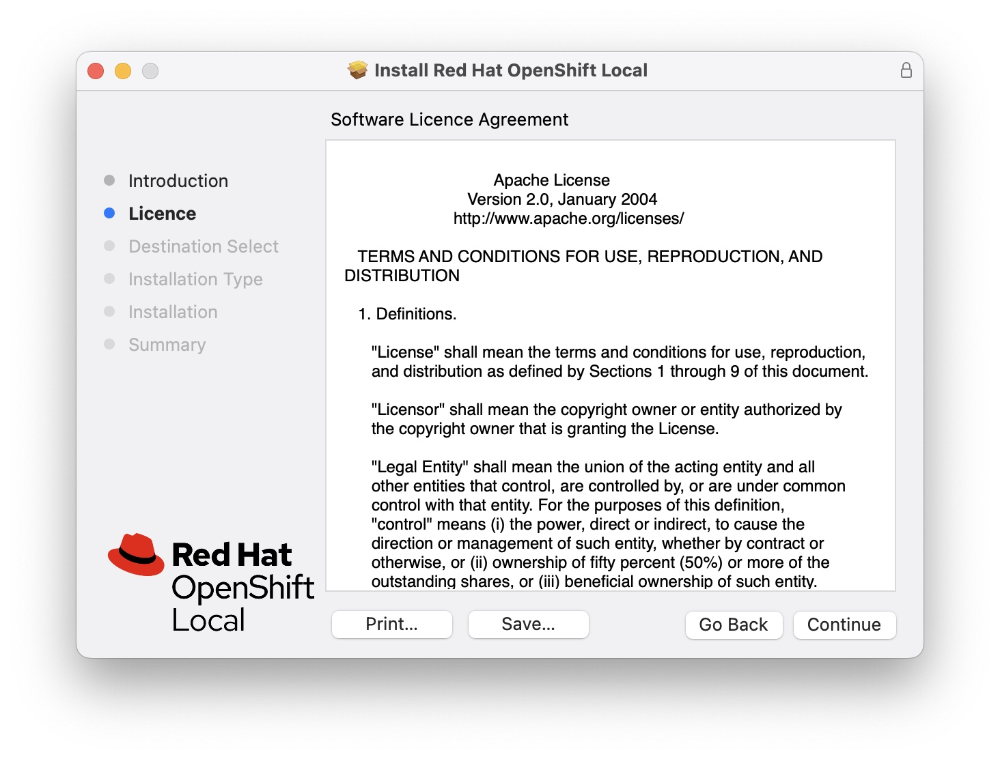
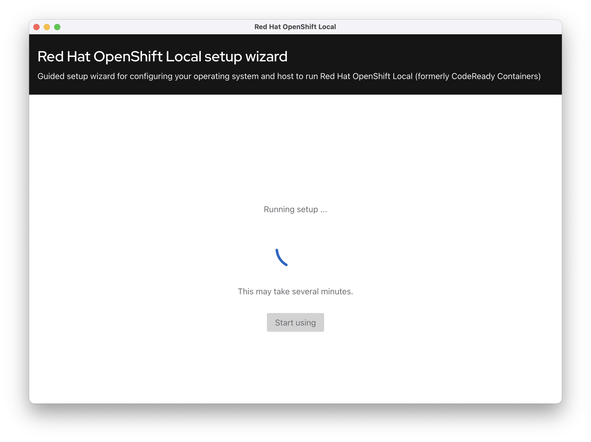

= Getting Started with OpenShift Local
Bjoern Steffens | December 2022
:doctype: book
:icons: font
:toc: left

== Why OpenShift local?
If you can run it on your laptop, it is designed for testing, trying things out and learn without having to have access to a larger Cloud setup. Think of it a little bit as a community edition for your own private purpose that you always have in your computer bag.

== Prerequisites for installing OpenShift local
The hardware requirements are very low but that does not guarantee that OpenShift Local will start on your system. I have two MacBooks , one with Intel CPUs, 64 GB RAM and an M1 with only 16 GB RAM. OpenShift does not launch on my M1 most likely due to insufficient resources as I have a few other things running on it too.

The best thing you can do because the installation is so easy, is to install it and see if it starts or not and then you have your answer within minutes.

TIP: The old name of OpenShift Local is CRC (Code Ready Containers). You will see references to CRC here and there because the name of the product recently changed.

.Links:
- https://developers.redhat.com/products/openshift-local/overview[Overview]
- https://crc.dev/crc/[RedHat Getting Started Guide]
- https://access.redhat.com/documentation/en-us/red_hat_openshift_local/2.11/html/getting_started_guide/installation_gsg[Installation]
- https://access.redhat.com/documentation/en-us/red_hat_openshift_local/2.11#configuring-the-instance_gsg[Product Documentation]

In essence this is what you need to be able to launch OpenShift Local

.Hardware Resources:
* 4 physical CPU cores
* 9 GB of free memory
* 35 GB of storage space

== Locating and downloading the code
You will need a RedHat subscription to be able to download the code. 

Have your RedHat login ready (parter account) and go to this link and download the appropriate package for your laptop OS. Mind to also download the pull secret. You will need it during the installation.

https://access.redhat.com/documentation/en-us/red_hat_openshift_local/2.5/html/getting_started_guide/installation_gsg[Software Download]

== Installing OpenShift local
The installation is very simple and consists of 1) the installation and 2) configuration. The configuration part can take several minutes to complete depending how powerful our laptop is. On my MacBook Pro 16" it took approximately 15 Minutes to complete the second configuration part before I could start and access the "mini cluster".

image::./images/install_03.jpg[alt=ls,width=720,height=480]

image::./images/install_14.jpg[alt=ls,width=420,height=480]

Default user and password is developer / developer

== Completely removing OpenShift local from a Macbook

.Use the command line
[source, sh]
----
eval $(crc oc-env)
crc stop
crc delete
crc cleanup # This does part of the left-over-cleanup on disk
rm -rf ~/.crc
----

.Steps to remove left-over if still present:
- Quit the application on the desktop
- Delete the App by dragging and dropping to bin or using CleanMyMac

.Look for any leftover here to really make sure you get everything off of the machine:
- ~/Library/
- ~/Library/Caches/
- ~/Library/Preferences/
- ~/Library/Application Support/
- ~/Library/Application Support/CrashReporter/
- ~/Library/Saved Application State/

.Shell command to run to find any remaining lefter overs
[source,terminal]
----
# Find the left over first
ls -altr ~/Library | grep -i red
rm -rf {whatever you find with "redhat"}

# Reboot the machine
# Reinstall and recofigure OpenShift local if required 
----

== How far can you take OpenShift Local?
Recently Rhett Widurski and Michael Klug hosted a few great education sessions teaching us how to manage a real cluster beast worth of OpenShift. I was able to do all those exercises on my OpenShift local installation, so it is rather powerful but of course only intended for test and development purposes. Having said that, you should not have to go and look for a productive cluster before you can try something out, this deployment type should suffice for most simple use cases.

== Appendix - AsciiDoctor
=== What is AsciiDoc
AsciiDoc can more than Markdown and lends itself better to technical documentation and collaboration across tools like Github. The syntax is more comprehensive vs Markdown and the learning investment pays off very swiftly when your documentation gets complex and intertwined.

AsciiDoc is opensource but has been around since many years and is getting better traction. There are standardization and communities working the tool contagiously hence it is something worthwhile to look into.

=== How do you edit and preview asciidoc files?
There are plugins to a few IDEs and the most prominent one is Visual Studio Code, where you can edit and live-preview the content. See AsciiDoc toolchain below how to convert an adoc file into other various formats.

.Links
- https://asciidoc.org/ [AsciiDoc]
- https://asciidoctor.org/[Asciidoctor]
- https://docs.asciidoctor.org/asciidoctor/latest/[Documentation]
- https://kate-editor.org/syntax/data/html/asciidoc.adoc.html[Comprehensive Cheat-Sheet and Sample file]

=== What is the asciidoc toolchain?
Editing an adoc file in Visual Studio Code, you need to transform the file into something consumable. 

TIP: The adoc file is rendered by Github so you can point to it and share the link and it can be consumed without having to first needing to install an IDE. Just like the file you are reading now.

.The most popular formats are:
- pdf
- html
- epub

You will need to install the command line toolchain and use a very few but easy command to transform the adoc file into one or more of the mentioned formats above.

.Before you install ascoiidoctor you need to install and activate xcode on your mac.
[source, terminal]
----
xcode-select --install
sudo xcode-select -r
sudo xcodebuild -license
----

.Installation instructions
- https://docs.asciidoctor.org/asciidoctor/latest/install/macos/[Getting the toolchain installed]

.Installing the pdf and epub converters
[source,terminal]
----
sudo gem install asciidoctor-pdf
sudo gem install asciidoctor-epub3
----

.Shell Commands to convert the file
[source,terminal]
----
# Change to the folder where your adoc file file

> asciidoctor-epub3 "Getting\ Started\ With\ OpenShift\ Local.adoc"
> asciidoctor-pdf "Getting\ Started\ With\ OpenShift\ Local.adoc"  
> asciidoctor "Getting\ Started\ With\ OpenShift\ Local.adoc"  
----

image::./images/asciidoc_convert_output_samples.jpg[alt=ls,width=720,height=480]

